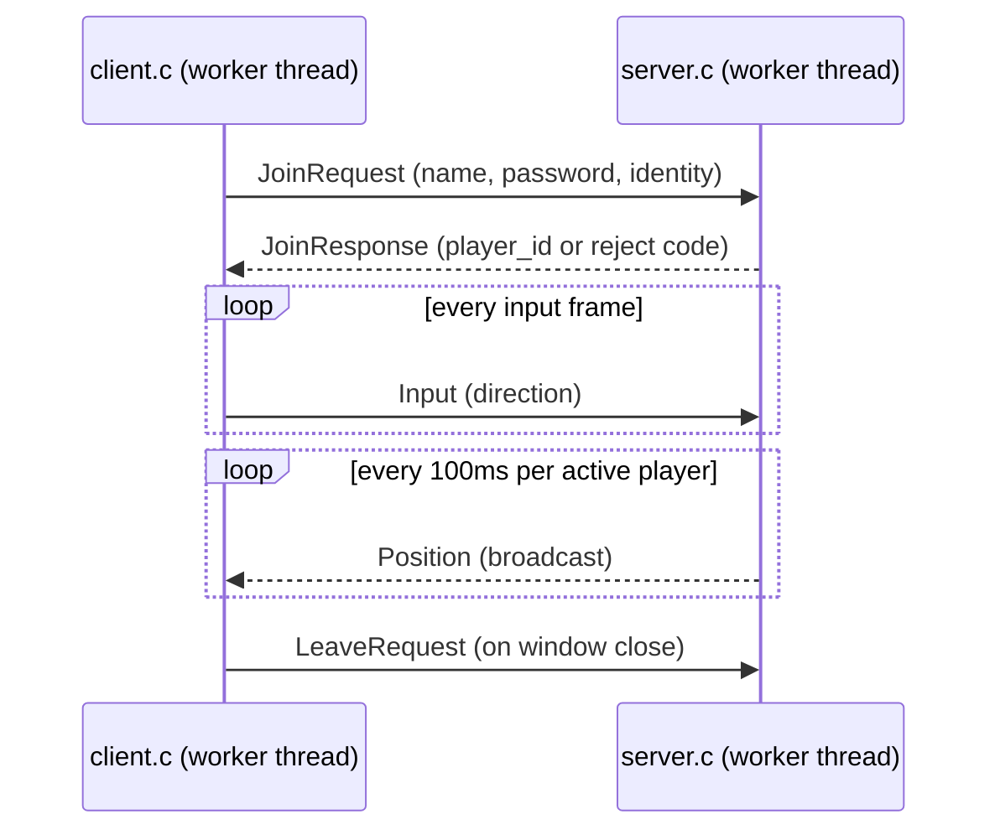

# Networking / Transport Layer Guide

This document explains exactly how `client.c` and `server.c` talk to each
other over Cyclone DDS, so you can (a) add new network features without
breaking the existing flow, and (b) know what to keep vs. throw away when
porting the project to C++ with your own renderer.

Everything here is about the **transport layer** — the DDS participants,
topics, readers and writers. The one existing piece of **application-layer**
logic (`auth.c`/`auth.h`, the login/password check) is called out separately
in [§7](#7-application-layer-vs-transport-layer-the-auth-example) as a
worked example of how the two layers are meant to stay separate.

---

## 1. The wire format: `messages.idl`

Every message that crosses the network is defined once, in
[`messages.idl`](../messages.idl), and compiled by `idlc` into
`messages.c`/`messages.h` (via the makefile rule `$(IDL_GEN): $(IDL_SRC)` —
this happens automatically on `make all`/`make server`/`make client`, you
never hand-edit `messages.c`/`.h`).

```idl
struct JoinRequest   { boolean b_dummy; char str_name[9]; char str_identity[32]; char str_password[65]; };
struct JoinResponse  { long int_player_id; char str_name[9]; };
struct Input         { long int_player_id; char ch_direction; };
struct Position      { long int_player_id; long int_x; long int_y; boolean b_active; char str_name[9]; };
struct LeaveRequest  { long int_player_id; char str_identity[32]; };
```

For each struct `Foo`, `idlc` generates in `messages.h`/`messages.c`:

- `Foo` — the plain C struct you fill in and pass to `dds_write`.
- `Foo_desc` — a `dds_topic_descriptor_t` describing the wire layout, passed to `dds_create_topic`.
- `Foo__alloc()` — heap-allocates one `Foo`, used as the landing buffer for `dds_take`.

**This is the actual application-layer/transport-layer boundary.** A new
network feature almost always starts here: add a field to an existing
struct, or add a whole new struct, then everything downstream (topics,
readers, writers, the poll loops) follows the same pattern already used by
the five structs above. See [§6](#6-recipe-adding-a-new-network-message) for
a full worked example.

---

## 2. The five topics and who talks to whom

DDS has no client/server concept at the transport level — it's pure
publish/subscribe. "Server" and "client" here are just roles *this
application* assigns: the server process happens to publish `JoinResponse`
and `Position` and subscribe to the rest; clients do the opposite. Nothing
in DDS enforces that; it falls entirely out of which topics each program
creates a writer or reader for.

| Topic | Publisher | Subscriber | Purpose |
|---|---|---|---|
| `JoinRequest` | client | server | "let me in" (name + password + DDS identity) |
| `JoinResponse` | server | client | accept (player ID) / reject (0, -1, -2, -3) |
| `Input` | client | server | one directional key-press |
| `Position` | server | client | authoritative position of one player, broadcast to all |
| `LeaveRequest` | client | server | "I'm disconnecting" |



Every reader in this codebase can see samples from **every** writer of that
topic across the whole domain — e.g. all clients share one `Position`
reader and get every player's position, not just their own. That's why
`client.c:383` filters incoming `JoinResponse` samples by name
(`strcasecmp(response->str_name, str_my_name)`) — the topic itself doesn't
address a single recipient.

---

## 3. Where the transport layer lives in each file

Both `server.c` and `client.c` follow the exact same four-part skeleton
inside their `worker()` function. Line numbers below are current as of this
guide; re-check them after edits.

### `server.c` — `worker()` (server.c:198-661)

| Step | Lines | What happens |
|---|---|---|
| 1. Create participant | 226-237 | `create_secure_participant(...)` — opens the DDS domain with the server's cert |
| 2. Create topics | 243-277 | one `dds_create_topic` per struct, binding the `_desc` to a string topic name |
| 3. Create readers/writers | 282-315 | `join_reader`, `input_reader`, `leave_reader`; `response_writer`, `position_writer` |
| 4. Poll loop | 332-660 | `while(1)`: `dds_take` each reader in turn, react, occasionally `dds_write` |

### `client.c` — `worker()` (client.c:222-545)

| Step | Lines | What happens |
|---|---|---|
| 1. Create participant | 251-262 | same `create_secure_participant(...)`, but with `certs/client<N>.pem/.key` |
| 2. Create topics | 268-302 | identical topic set, same names/descriptors, so discovery matches server's |
| 3. Create readers/writers | 308-341 | `join_writer`, `input_writer`, `g_leave_writer`; `response_reader`, `position_reader` |
| 4. Poll loop | 362-544 | `while(1)`: `dds_take` responses/positions, `dds_write` join/input/leave |

**Key fact for the refactor:** `create_secure_participant()`/`file_uri()`
are copy-pasted verbatim in *three* places — `server.c:140-196`,
`client.c:164-220`, and the unused template `secure_participant.c` (which
is **not** compiled by the makefile at all — it's dead reference code with
instructions in its own header comment to paste it into each program
manually). When you port to C++, this is the first thing to collapse into
one shared translation unit (e.g. `SecureParticipant.cpp/.hpp`) — the two
copies are already byte-for-byte identical.

---

## 4. The poll loop pattern (how `dds_take` / `dds_write` are actually used)

Every read follows this exact shape (e.g. server.c:335-341):

```c
rc = dds_take(join_reader, samples_join, infos_join, MAX_SAMPLES, MAX_SAMPLES);
if (rc < 0) DDS_FATAL(...);
if ((rc > 0) && (infos_join[0].valid_data)) {
    JoinRequest *request = (JoinRequest *)samples_join[0];
    // ... react to request ...
}
```

- `dds_take` **removes** matching samples from the reader's local cache and
  copies them into your pre-allocated buffer (`samples_join[0]`, allocated
  once via `JoinRequest__alloc()` at server.c:319). `MAX_SAMPLES` is `1`
  everywhere in this codebase (server.c:31) — one sample is read per call,
  per topic, per loop iteration.
- `infos_join[0].valid_data` guards against "instance disposed"
  notifications that carry no real payload — always check it.
- This is **pull-based polling**, not a callback. The `while(1)` loop calls
  `dds_take` on every reader, every iteration, whether or not anything
  arrived, with small `dds_sleepfor(DDS_MSECS(...))` calls scattered around
  to avoid spinning at 100% CPU. See [§5](#5-dds-pubsub-vs-the-observer-pattern)
  for why this matters to your mental model.

Every write follows this shape (e.g. client.c:463):

```c
rc = dds_write(join_writer, &request);
if (rc != DDS_RETCODE_OK) DDS_FATAL(...);
```

`dds_write` hands the sample to CycloneDDS, which serializes it and sends
it (encrypted, per `governance.xml`) to every matched reader in the domain.
It does not block waiting for delivery confirmation — the QoS in use here
(all `NULL` in `dds_create_topic`/`dds_create_reader`/`dds_create_writer`,
e.g. server.c:243-315) is CycloneDDS's **default profile**: `BEST_EFFORT`
reliability, `KEEP_LAST(1)` history, `VOLATILE` durability. Concretely:

- A sample can be silently dropped in transit — there is no retransmission.
- Only the *latest* unread sample per topic is kept if you don't call
  `dds_take` often enough; older ones are overwritten.
- A late-joining reader gets nothing published before it existed.

This is *why* the join handshake is written as a resend loop instead of a
single reliable request: `client.c:457-472` re-sends `JoinRequest` every
second until a matching `JoinResponse` shows up, rather than trusting a
single write to arrive. If you want guaranteed, ordered delivery for a new
control-plane message (vs. best-effort for fast-changing state like
`Position`/`Input`), set an explicit QoS with `DDS_RELIABILITY_RELIABLE`
and `DDS_HISTORY_KEEP_ALL` on that topic's reader/writer instead of passing
`NULL` — a good candidate to standardize on in the C++ rewrite.

---

## 5. DDS pub/sub vs. the Observer pattern

Your instinct is right that DDS pub/sub is a cousin of Observer, but there
are two differences worth being precise about before you refactor:

**1. No explicit subject/observer registration.** In classic Observer, a
`Subject` holds a list of `Observer*` and calls `notify()` on each one
directly. In DDS there's no such list in your code at all — `dds_create_topic`
just declares "this type, under this name, exists in this domain."
Matching of writers to readers happens via CycloneDDS's own discovery
protocol (multicast on the local network, or whatever's configured) —
your code never sees a peer list or holds a pointer to "who is subscribed."
This is what let `server.c` and `client.c` be written without either
knowing the other's IP/port. Anything you replace this with (e.g. a raw
socket layer) will need to reintroduce presence-tracking that DDS is
currently doing for free.

**2. Pull, not push.** Textbook Observer is a *push*: the subject calls
`observer->update(...)` synchronously the moment state changes. This
codebase's readers are polled (`dds_take` in a `while(1)` loop, §4) — the
"observer" (reader) asks "anything new?" on its own schedule rather than
being called back. DDS actually supports a genuine push model too, via
**listeners**:

```c
dds_listener_t *listener = dds_create_listener(NULL);
dds_lset_data_available(listener, on_join_request_received); // your callback
join_reader = dds_create_reader(participant, join_topic, NULL, listener);
```

`on_join_request_received(dds_entity_t reader, void *arg)` then fires
*asynchronously, on a CycloneDDS-internal thread*, whenever a sample
arrives — no polling loop needed for that topic at all. This is the closer
match to Observer's `update()`, and is worth adopting in the C++ rewrite if
you want the networking code to read like "subscribe once, react via
callback" rather than "loop forever, ask every topic if it has anything."
The tradeoff: your callback runs on Cyclone's thread, so you'll need the
same kind of mutex-guarded handoff to your render/game thread that this
codebase already does for keyboard input (`ch_dir`, guarded by `mutex` in
`client.c`) — just triggered by the middleware instead of by you.

A middle ground, if you don't want callback-on-arbitrary-thread semantics,
is a **waitset** (`dds_create_waitset` + `dds_waitset_wait`): block your own
thread until any of several readers has data, instead of sleep-polling each
one. Still pull-based (you decide when to drain the reader), but without
the fixed-latency/busy-loop tradeoff of `dds_sleepfor`.

---

## 6. Recipe: adding a new network message

Worked example: adding a `ChatMessage { long int_player_id; char str_text[128]; }`
broadcast from any client to all others, relayed through the server (same
shape as `Input`/`Position`).

1. **`messages.idl`** — add the struct:
   ```idl
   struct ChatMessage
   {
       long int_player_id;
       char str_text[128];
   };
   ```
   `make` regenerates `messages.c`/`.h` automatically next build (don't hand-edit them).

2. **Sender side** (whichever program originates it — here, `client.c`):
   - Declare a topic + writer in `worker()`, alongside the existing ones (client.c:282-325 pattern):
     ```c
     dds_entity_t chat_topic = dds_create_topic(participant, &ChatMessage_desc, "ChatMessage", NULL, NULL);
     dds_entity_t chat_writer = dds_create_writer(participant, chat_topic, NULL, NULL);
     ```
   - Somewhere in the `while(1)` loop, build a `ChatMessage` and `dds_write(chat_writer, &msg)` — same shape as the existing `Input` write at client.c:485-496.

3. **Receiver side** (`server.c`, to relay/log it):
   - Same topic (must match name/descriptor exactly), but a reader instead:
     ```c
     dds_entity_t chat_topic = dds_create_topic(participant, &ChatMessage_desc, "ChatMessage", NULL, NULL);
     dds_entity_t chat_reader = dds_create_reader(participant, chat_topic, NULL, NULL);
     void *samples_chat[MAX_SAMPLES];
     dds_sample_info_t infos_chat[MAX_SAMPLES];
     samples_chat[0] = ChatMessage__alloc();
     ```
   - In the poll loop, alongside the existing `dds_take` calls (server.c:335, 536, 611):
     ```c
     rc = dds_take(chat_reader, samples_chat, infos_chat, MAX_SAMPLES, MAX_SAMPLES);
     if ((rc > 0) && infos_chat[0].valid_data) {
         ChatMessage *chat = (ChatMessage *)samples_chat[0];
         // validate/relay/log
     }
     ```

4. **Broadcast back out**, if the server needs to relay to all clients: add
   a `chat_writer` on the server side and a matching `chat_reader` on the
   client side, mirroring how `Position` already works (server publishes,
   every client subscribes and filters/renders by `int_player_id`).

5. **If the new message needs a request/response accept-or-reject pattern**
   (like `JoinRequest`/`JoinResponse`), copy the pattern in
   §[4]/server.c:394-467: write a response with a sentinel status field, and
   have the requester filter incoming responses by an identifying field
   (server.c uses `str_name`; you might use `int_player_id` once assigned).

6. **If validation/state belongs at the application layer** (e.g. profanity
   filtering, rate-limiting), don't inline it into `worker()` — follow the
   `auth.c` pattern from §7 instead.

The one thing to watch: every `char[]` field is fixed-size and
null-terminated by convention, not by the IDL — always `strncpy` +
explicit `'\0'` at the last byte, exactly as every existing field does
(e.g. `client.c:345-346`). IDL `char foo[N]` reserves *N* bytes total, not
*N* usable characters.

---

## 7. Application layer vs. transport layer: the `auth.c` example

`auth.c`/`auth.h` is deliberately **not** DDS-aware at all — it's a plain
username/password verifier (PBKDF2-HMAC-SHA256, salted, persisted to
`players.auth`). `server.c` is the only file that calls into it, and only
at one call site, inside the existing join-handling block:

```c
// server.c:368-372
AuthResult auth_result = AUTH_OK;
if (!b_name_taken && !b_identity_taken)
{
    auth_result = auth_authenticate(str_req_name, str_req_password);
}
```

The transport layer's job stops at "here is a `JoinRequest` struct with a
`str_password` field, deserialized off the wire" (that field only exists
because it's now part of `messages.idl`, §1). Everything about *what a
valid password looks like, where credentials are stored, how they're
hashed* lives entirely in `auth.c`, which `server.c` treats as a black box
returning `AUTH_OK` / `AUTH_BAD_PASSWORD` / `AUTH_ERROR`.

**This is the template to copy** for new application-layer features: add
whatever raw fields you need to the relevant IDL struct (transport layer),
then put the actual game/business logic in its own `.c`/`.h` (or, in your
C++ rewrite, its own class) that `worker()` calls into with plain values —
never reach into DDS internals from that logic, and never inline business
rules into the `dds_take`/`dds_write` poll loop itself.

---

## 8. Threading model (matters for the refactor)

Both programs use exactly two threads, coordinated by one global
`pthread_mutex_t mutex`:

- **`server.c`**: `main()` spawns `worker()` on a second thread
  (server.c:676) and itself runs a second loop that assigns player IDs
  and spawns the initial position (server.c:683-774). The two threads
  hand off through the mutex-guarded globals `b_player_join`,
  `int_new_player_id`, `str_pending_name`/`str_pending_identity`, and the
  shared `arr_Players[]` table.
- **`client.c`**: `main()` runs the GLFW render/input loop
  (client.c:605-680) on the main thread, and spawns `worker()`
  (client.c:576) to own every DDS reader/writer. They hand off through
  `mutex`-guarded globals: `ch_dir` (render thread → worker, keyboard
  input to send), and `arr_Players[]`/`int_player_id`/`str_my_name` (worker
  → render thread, world state to draw).

**For the C++ rewrite:** this mutex-guarded-globals approach is exactly
what you'll want to formalize into a small thread-safe "network state"
class — e.g. a `NetworkClient` that owns the DDS participant/topics/readers/
writers and exposes thread-safe getters (`getPlayers()`, `getMyPlayerId()`)
and setters (`sendInput(direction)`) to your renderer, instead of the
renderer reaching into free-standing global arrays. That single seam is
also exactly where you unplug the current immediate-mode-OpenGL rendering
(client.c:74-98, 582-680, and `stb_easy_font.h`) without touching any
networking code — nothing in `worker()` calls into GLFW or `gl*` functions,
so the split is already clean at the file level; it's just not yet
expressed as a class boundary.

---

## 9. Testing remote (non-LAN) connections

Nothing in this repo sets CycloneDDS's discovery config — `dds_create_participant(DDS_DOMAIN_DEFAULT, qos, NULL)` (server.c:207, client.c:209) is called with no config beyond the security QoS — so both programs fall back to Cyclone's built-in default: SPDP discovery via UDP **multicast** (§5). That works on a LAN/WiFi with zero setup, but multicast essentially never crosses routers/NAT, so a `server` and `client` on different networks won't discover each other unmodified.

Two ways to fix that, neither touching any `.c`/`.h`/`.idl` file:

### Option A — unicast peer list (works over the open internet)

Point Cyclone at an explicit peer address instead of relying on multicast:

```xml
<!-- cyclonedds.xml -->
<CycloneDDS>
  <Domain>
    <General>
      <AllowMulticast>false</AllowMulticast>
    </General>
    <Discovery>
      <Peers>
        <Peer address="myserver.ddns.net"/>
      </Peers>
    </Discovery>
  </Domain>
</CycloneDDS>
```

Set `CYCLONEDDS_URI=file:///path/to/cyclonedds.xml` in the environment before launching `server`/`client` — Cyclone reads it at participant creation, so it must be set before the process starts; there's no in-code equivalent to add.

`Peer address` accepts a hostname (Cyclone resolves it via normal DNS at participant-creation time), so a dynamic-DNS name pointing at a rotating home IP works fine there. One caveat: that resolution happens **once**, at startup — Cyclone doesn't re-poll DNS afterward, so if the DDNS record changes mid-session the already-running client won't follow it; restart the client to force a fresh lookup.

Reachability, not just addressing, is the other half of this:

- Only the side other peers dial *first* needs a forwarded/open port. In this app that's the server: clients discover it via `Peer address`, and the server then learns each client's address from the packets it receives — so on an ordinary (non-symmetric) NAT, clients don't need any inbound rule of their own.
- The forwarded external port has to match the port Cyclone actually binds internally (or set `General/ExternalNetworkAddress`/`ExternalMaskedNetworkAddress` in the config) — otherwise Cyclone keeps advertising its private LAN address to peers and the port-forward doesn't help.
- Symmetric NAT or a strict corporate firewall on the client side can still break the "client needs nothing" assumption; if that happens, either forward on both ends or use Option B.

### Option B — VPN overlay (Tailscale/WireGuard)

Put the server and client machines on the same virtual subnet. Multicast/broadcast discovery then works completely unmodified — from Cyclone's point of view it's just a LAN — so this needs no config file and no `CYCLONEDDS_URI` at all. Faster to get working for a one-off test, but less representative of what a real internet deployment needs (Option A's NAT/port-forwarding issues are exactly what you'd hit deploying for real).

---

## 10. Quick reference: files to touch for common changes

| You want to... | Touch |
|---|---|
| Add/change a field on an existing message | `messages.idl` only, then re-`make` |
| Add a brand-new message type | `messages.idl` + topic/reader/writer + poll-loop handling in whichever `worker()`(s) send/receive it (§6) |
| Add new application/game logic (auth-like) | a new `.c`/`.h` (or C++ class) called from `worker()`, never inlined into the DDS poll loop (§7) |
| Change transport security (certs, encryption, access rules) | `governance.xml`, `permissions.xml`, `gen_certs.sh`, `certs/` — untouched by anything in §1-§8 |
| Replace polling with push callbacks | swap `dds_take`-in-a-loop for `dds_set_listener`/`dds_lset_data_available` per reader (§5) |
| Test server/client across different networks, not just LAN | `CYCLONEDDS_URI` env var + a `cyclonedds.xml` (unicast `Peers`, §9) — or a VPN overlay; no repo files change |
| Replace the renderer | `client.c`'s GLFW/OpenGL block only (client.c:74-98, 582-680) + `stb_easy_font.h`; the DDS `worker()` function needs no changes |
